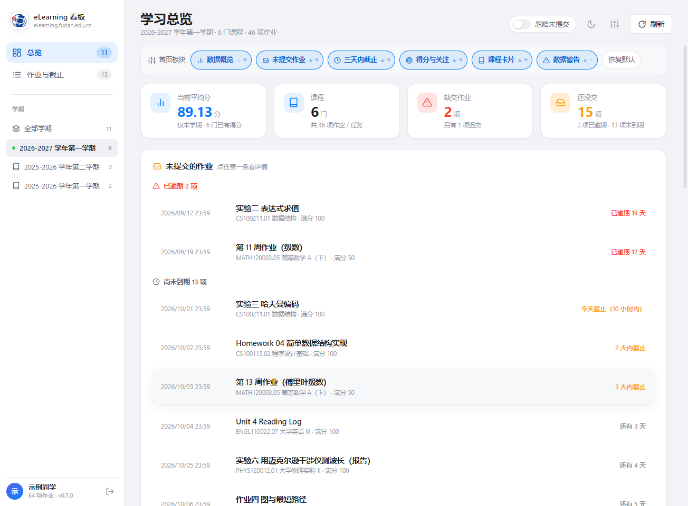
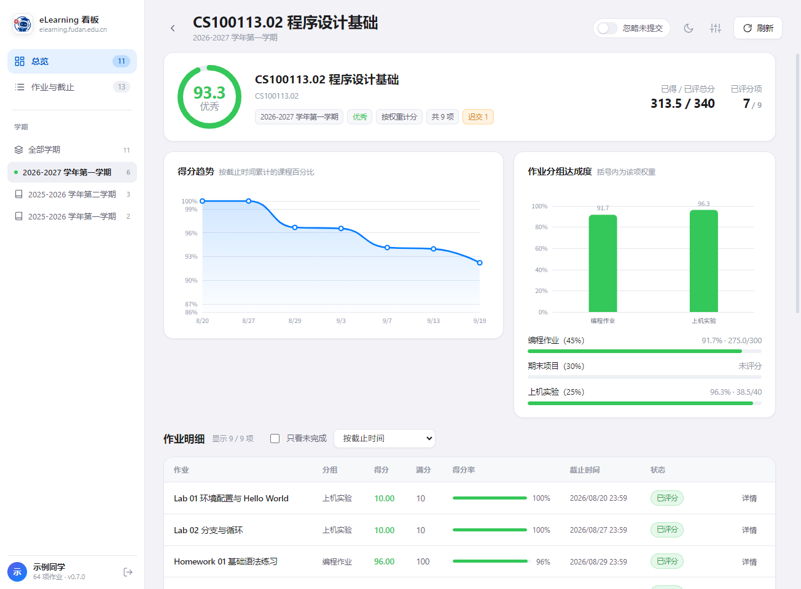
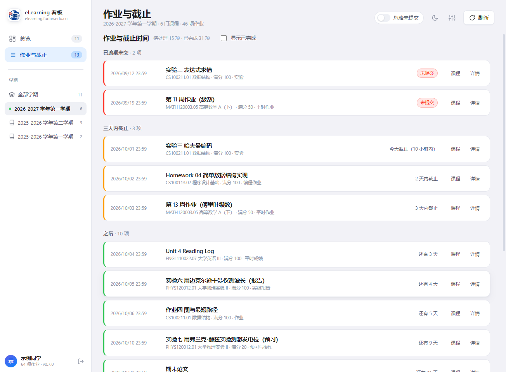
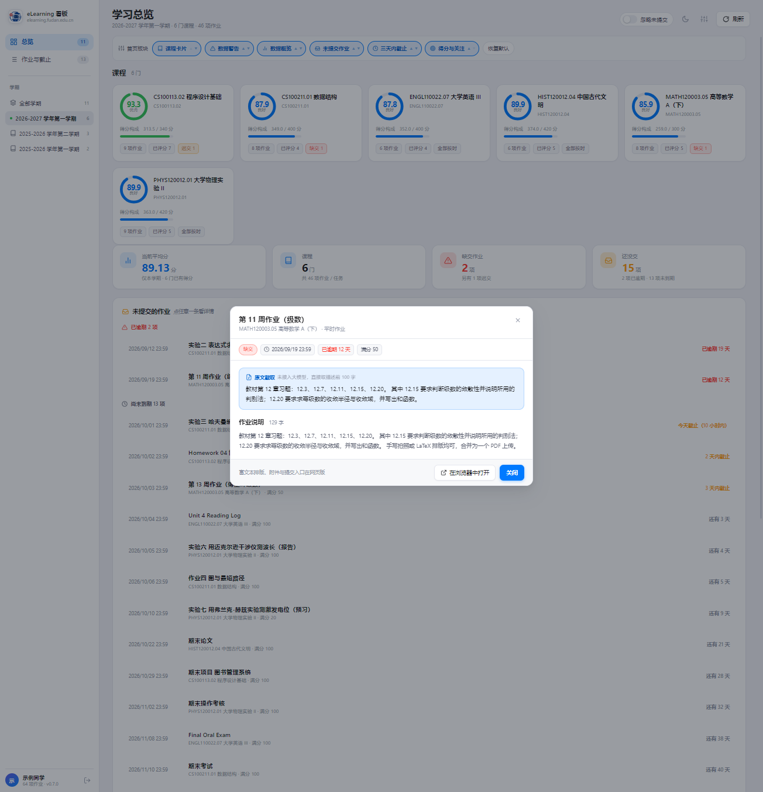
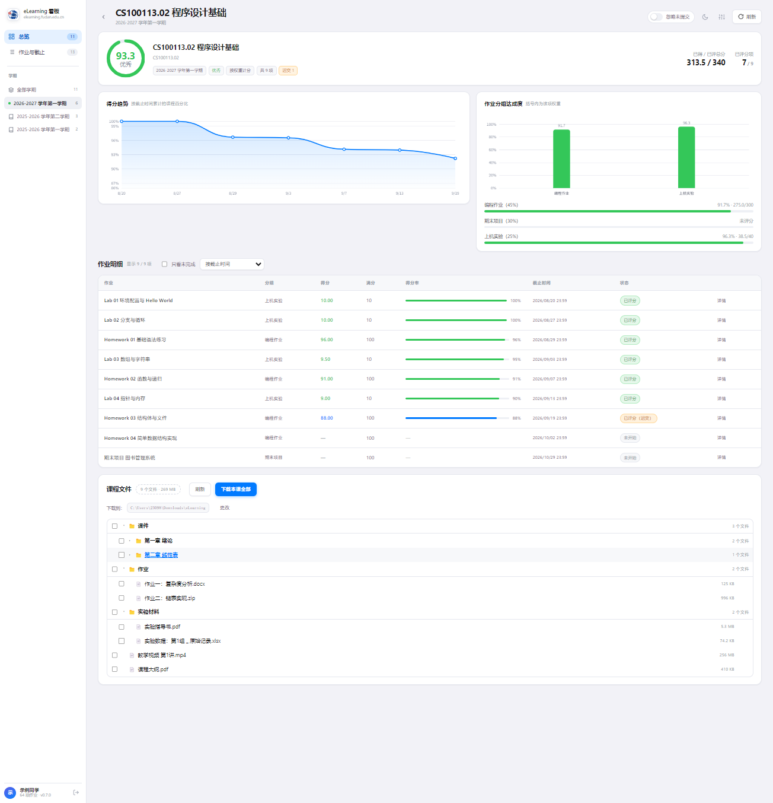

# 复旦大学 eLearning 学习看板

用你的复旦统一身份认证账号登录 [elearning.fudan.edu.cn](https://elearning.fudan.edu.cn/)（Canvas LMS），
把**课程、作业、成绩、截止时间**拉下来，用图表直观地展示每门课的得分情况。

登录流程参考了 [DanXi（旦夕）](https://github.com/DanXi-Dev/DanXi) 的做法——直接对接复旦大学统一身份认证，
不依赖任何第三方服务器。

> **两个端，同一套逻辑**
>
> | 端 | 技术 | 位置 |
> | --- | --- | --- |
> | Windows 桌面 | Electron + React | 本目录（见下文） |
> | iOS / Android | Flutter + Dart | [`flutter_app/`](flutter_app/README.md) |
>
> 统一身份认证协议、Canvas 接口口径、成绩算法与设计 token 两端完全一致，改动需同步。



## 课程文件

每门课的详情页最下面有「课程文件」一节：展示 Canvas 上的文件夹与文件树。

- **点文件名**直接下载这一个
- **勾选框多选**，出现「下载选中」批量下载
- **「下载本课全部」**整门课一次拉完

下载到磁盘时按 `学期 / 课程 / Canvas 子文件夹 / 文件名` 建目录，例如：

```
D:\eLearning\2026-2027 学年第一学期\CS100113.02 程序设计基础\课件\第1章\绪论.pdf
```

文件名会做跨平台净化（`/ : * ?` 等替换为下划线、Windows 保留设备名加前缀），
同目录重名自动加 ` (2)` 后缀，`A.pdf` 与 `a.pdf` 不会互相覆盖。

## 图标

源图放在 `build/icon-new-source.png`，一条命令生成所有端的图标：

```bash
python recon/make-icons.py
cd flutter_app && dart run flutter_launcher_icons
```

产出：

| 文件 | 用途 |
| --- | --- |
| `build/icon.ico` | Windows（16/24/32/48/64/128/256 七个尺寸） |
| `build/icon.png` | electron-builder 用 |
| `flutter_app/assets/icon/icon_ios.png` | iOS：满幅方图、无 alpha（系统自己套圆角） |
| `flutter_app/assets/icon/icon.png` | macOS / web：圆角 + 透明角 |
| `flutter_app/assets/icon/icon_foreground.png` | Android 自适应图标前景 |
| `flutter_app/assets/brand/mark.png` | 应用内品牌标识（**去掉文字**的纯图形版） |

### 两个容易踩的坑

**① Android 前景的「双重缩小」。** `flutter_launcher_icons` 生成
`mipmap-anydpi-v26/ic_launcher.xml` 时会给前景加 `android:inset="16%"`，
也就是 drawable 只占画布中央的 68%。如果前景图自己再缩到 62%，
两者叠加后 Logo 只剩 **36%**——小得离谱，而且在桌面预览里看不出来
（必须按真实 inset 合成才量得出来）。现在前景直接用母版（图案占 86%），
叠加 inset 后约 59%，正好落在安全区。

**② iOS 不能预切圆角。** 系统会自己套用圆角遮罩，图标若预先切了圆角，
四角会露出白边。所以 iOS 用的是满幅方图。这个坑更隐蔽的是配置写法：
`flutter_launcher_icons` 的平台专属覆盖要用扁平的 `image_path_ios`，
写成嵌套的 `ios: { image_path: ... }` 会被**静默忽略**，
图标带着透明角生成，肉眼很难发现。当时是逐像素查出四角 alpha=0 才定位到的。

### 已知取舍：小尺寸下文字不可读

源图是「图形 + 复旦 eLearning + 校园助手」的完整组合标识。
在 16/32/48 像素（Windows 任务栏、Android 状态栏）下，
那两行文字会糊成灰斑。预览图见 `build/icon-compare.png`。

应用内的品牌标识（侧边栏、登录页，只有 34–42 像素）
用的是**去掉文字的纯图形版** `assets/brand/mark.png`，
否则那个尺寸下就是一团糊。

## 视觉设计

界面参考了复旦校园助手 [DanXi（旦夕）](https://github.com/DanXi-Dev/DanXi) 的设计语言：
iOS 风格的**浅灰底 + 纯白卡片**，主色 `#007AFF`；深色模式则是纯黑底 + `#1C1C1E` 抬升卡片，主色 `#0A84FF`。

| | 页面底 | 侧边栏 | 卡片 | 正文 |
| --- | --- | --- | --- | --- |
| 浅色 | `#F2F2F7` | `#FFFFFF` | `#FFFFFF` | `#1C1C1E` |
| 深色 | `#000000` | `#141416` | `#1C1C1E` | `#F2F2F7` |

关键点在**页面底和卡片必须有明确色差**——两者若同色，卡片边界只能靠描边区分，看久了很累。
右上角的 ☾/☀ 按钮切换明暗，选择会记住。

布局采用**左侧边栏**：导航、学期列表、个人信息各居其位，主区域专心放内容。
学期多时侧栏纵向滚动，不会把控件挤出屏幕。

---

## 它能看到什么

| 界面 | 内容 |
| --- | --- |
| **侧边栏** | 导航、**学期列表**（当前学期标绿点，各带课程数）、个人信息与版本号。默认自动停在你正在上的那个学期 |
| **总览** | 顶部一排**板块开关与排序**；四张统计卡（平均分、课程数、缺交、**还没交**）；**未提交的作业**（按已逾期 / 尚未到期分组）；三天内截止；各课程得分柱状图；需要关注的课程 |
| **课程详情** | 环形得分仪表、已得/已评总分、**作业分组达成度**（按 Canvas 权重）、**得分趋势折线**、逐条作业明细、**课程文件**（可下载） |
| **作业详情** | 点任意作业打开：完整说明、提交状态、成绩、时间线，以及**100 字以内简介** |
| **作业与截止** | 按「已逾期未交 / 三天内 / 之后 / 无截止时间 / 已完成」分组，带相对时间提示 |





### 首页板块可以自己排

最上面一排胶囊就是当前首页的板块：

- **点名字**开关某个板块
- **点 ▲▼** 上下移动它的位置
- 改动会记住；顺序表里没提到的板块按默认顺序补在后面，所以以后新增板块不会漏看
- 右侧「恢复默认」一键还原

「未提交的作业」是新增的一块：按**已逾期 / 尚未到期**分组列出所有还没交的东西。
以前首页只有一个「缺交」总数，看不出具体欠了哪些。

### 作业详情与 100 字简介

点作业不再直接跳浏览器，而是打开应用内的详情：完整说明、提交状态、截止与逾期、成绩。

顶部会有一段 **100 字以内的简介**，并标明来源：

| 标注 | 含义 |
| --- | --- |
| **AI 摘要** | 你配了大模型接口，由模型压缩 |
| **原文截取** | 没配接口，直接取说明前 100 字 |

在工具栏的滑块图标里配置（OpenAI 兼容格式，内置 DeepSeek / Kimi / GLM / 通义 / OpenAI 预设）。
**不配也能用**——调不通、超时、返回空都会自动降级成截取，并在界面上说明原因。
简介按描述内容指纹缓存，同一份说明只会花一次调用。



### 课程文件与下载

课程详情页最下面是「课程文件」：Canvas 上的文件夹与文件树。

- **点文件名**直接下载这一个
- **勾选框多选**，顶部出现「下载选中」
- **「下载本课全部」**整门课一次拉完

下载到磁盘时按 `学期 / 课程 / Canvas 子文件夹 / 文件名` 建目录：

```
D:\eLearning\2026-2027 学年第一学期\CS100113.02 程序设计基础\课件\第1章\绪论.pdf
```

文件名会做跨平台净化（`/ : * ?` 等替换为下划线、Windows 保留设备名加前缀），
同目录重名自动加 ` (2)` 后缀，`A.pdf` 与 `a.pdf` 不会互相覆盖。



### 两种"噪音"的处理

**已交的作业不会被标成逾期。** 一份已经交上去、只是还没批改的实验报告，过了截止时间不该显示
「已逾期 3 天」——那只剩老师批改这一步了。判定依据是「学生是否已交」（有得分 / 有提交时间 /
Canvas 的 workflow state 为 submitted），而不是「是否已批改」。所以这类作业现在显示
**「已提交待评分」**，边框是中性色而不是警告红。

**「忽略未提交的作业」开关**（标题栏右上角，会记住设置）：打开后，尚未提交的作业从各处隐藏——
作业清单、课程详情表格、总览的「缺交作业」与「近期待办」计数。
它**只影响显示，不影响得分**：未提交且未批改的作业本来就不计入 Canvas 的当前分数，
本地重算也是同样口径。打开时作业清单会自动改为显示「已完成」，不会变成空白。

**所有统计都限定在当前选中的学期内**——把不同学期的课混在一起算平均分是没有意义的。
切到「全部学期」时，每张课程卡上会额外标出它属于哪个学期。

分数计算说明：Canvas 自己会返回一个 `computed_current_score`，但它在作业未批改时为空，
且不一定反映作业分组的权重。所以本应用会**根据每次提交的得分与满分重新计算**，
对有权重的作业分组按权重加权（未批改的分组剔除后重新归一化权重）。
服务器返回的分数存在时优先显示服务器值，分组明细则一律使用本地重算结果。

学期信息来自 Canvas 的 `include[]=term`；即使该参数不可用，也会用 `enrollment_term_id` 正确归类，
只是学期名会退化成占位标签。已结束学期的课程会额外合并 `enrollment_state=completed` 的结果，
避免某些部署把结课课程从默认列表里省略掉。

---

## 安装与使用

### 方式一：直接安装（推荐）

下载 `Fudan-eLearning-Dashboard-x.y.z-setup.exe`，双击安装，然后从开始菜单或桌面快捷方式启动。

### 方式二：从源码运行

```powershell
npm install
npm run dev        # 开发模式（带热更新）
# 或者
npm run build && npm start
```

> **注意**：如果你的终端环境里有 `ELECTRON_RUN_AS_NODE=1`（某些 Electron 应用会向子进程注入这个变量），
> Electron 会被降级成纯 Node 运行并报 `Cannot read properties of undefined (reading 'whenReady')`。
> 启动前先清掉它：
> ```powershell
> Remove-Item Env:ELECTRON_RUN_AS_NODE -ErrorAction SilentlyContinue
> ```

### 想先看看界面长什么样

不需要账号，用内置的演示数据预览：

```powershell
npm run demo
```

---

## 登录说明

应用使用**学号 + 统一身份认证密码**登录，走的是学校认证服务器的标准流程：

```
elearning.fudan.edu.cn/login/cas
  → id.fudan.edu.cn/idp/authCenter/authenticate
  → 获取 RSA 公钥 → 查询认证方式 → 提交加密后的密码
  → 换取服务票据 → 回到 eLearning，拿到 Canvas 会话
```

密码用 RSA（PKCS#1 v1.5）加密后提交，与学校登录页面自身的行为一致。

### 关于密码安全

- 密码**默认不写入磁盘**，只用于当次登录的内存中。
- 勾选「记住密码」后，密码会用 **Windows DPAPI**（`safeStorage`）加密后保存在本机用户目录，
  只有当前 Windows 用户能解密。可随时点「退出」清除。
- 应用只会向 `*.fudan.edu.cn` 发起请求。会话 Cookie 保存在本机，供后续刷新使用。
- 渲染进程（界面）**无法直接访问网络或 Cookie**，所有请求都由主进程完成。

### 关于登录次数被锁定

学校认证服务器在多次密码错误后会要求验证码，甚至临时锁定账号。为避免白白消耗尝试次数，
本应用在**提交密码之前**会先调用认证服务器的 `verifyCodeIsNeed` 接口确认是否需要验证码：

- 若不需要 → 正常提交；
- 若需要 → 弹出验证码图片让你填写（和学校登录页一样），而不是直接失败一次。

如果账号已被锁定，请等待自动解锁或联系信息办。

---

## 命令行工具

除了图形界面，仓库里还有两个可直接用 `node` 运行的小工具，方便排查问题和导出数据。

### 1. 链路自检（不需要密码）

在提交任何凭据之前，验证整条认证链路是否仍然可用：

```powershell
npm run doctor
```

它会检查：eLearning 可达性、Canvas 实例识别、CAS 跳转链、IdP 参数解析、
RSA 公钥获取与加密、可用认证方式、以及离线的 HTML/Cookie 解析单元测试。

**登录失败时请先跑这个**，它能区分「学校改了认证流程」和「你的密码不对」。

### 2. 缓存兼容性测试（不需要密码）

```powershell
npm run test:cache
```

校验本地缓存的形状处理：旧版本写的缓存能否被安全升级、损坏的缓存是否会被拒绝而不是半信半疑地使用，
以及本机真实缓存文件能否正常读取。这一类问题不会报错，只会让界面白屏，所以用测试钉死。

### 3. 数据快照导出

```powershell
npm run cli                      # 交互式输入学号密码
npm run cli -- --reuse           # 复用已保存的会话
npm run cli -- --out data.json   # 指定输出文件
npm run cli -- --active          # 只取当前学期在修的课程
```

会在终端打印各科得分表，并把完整数据写入 `snapshot.json`（含每一条作业的得分与截止时间）。
若认证服务器要求验证码，它会把验证码图片存成 `captcha.png` 并尝试打开，然后让你输入。

---

## 项目结构

```
src/
  core/                 # 与界面无关的核心逻辑，可直接用 node 运行
    cookies.ts          #   自实现的 Cookie 容器（跨域登录链必需）
    http.ts             #   带 Cookie 与手动重定向的 fetch 封装
    uis.ts              #   复旦统一身份认证登录（对标 IdP 前端真实实现）
    canvas.ts           #   Canvas REST 客户端（含 Link 头分页）
    scoring.ts          #   纯成绩计算：加权、分组达成度、趋势
    aggregate.ts        #   拉取并组装快照
    session.ts          #   会话（仅 Cookie）持久化
    demo.ts             #   演示数据（仅供预览）
    errors.ts, types.ts
  main/index.ts         # Electron 主进程：窗口 + IPC + 所有网络请求
  preload/index.ts      # contextBridge 安全桥接
  renderer/             # React + ECharts 界面
cli/                    # 命令行工具（doctor / snapshot）
recon/                  # 协议侦察脚本与抓取的响应（开发用）
```

### 为什么网络请求放在主进程

Canvas 不返回 CORS 头，浏览器环境下的渲染进程无法直接请求；
更重要的是，让会话 Cookie 留在主进程可以确保它永远不会暴露给页面内容。

---

## 技术栈

- **Electron 33** + **electron-vite** + **Vite 5**
- **React 18** + **TypeScript** + **ECharts**
- **electron-builder** 打包为 NSIS 安装包
- 密码加密使用 Node 内置 `crypto`（RSA PKCS#1 v1.5），无额外加密依赖

---

## 常见问题

**Q：打开后是空白窗口，看不到登录界面？**
这是 0.3.0 及更早版本的一个 bug，**0.4.0 已修复**。原因是旧版本写下的本地缓存缺少新版本需要的字段，
读取时让整个界面崩掉了。现在每次读缓存都会先做形状校验和补全，无法修复的缓存会被丢弃并重新拉取。
如果你还在用旧版，装 0.4.0 即可；界面上万一再出现渲染错误，现在会显示可读的错误信息和
「清除本地缓存并重新加载」按钮，而不是一片空白。

**Q：提示「登录状态已失效」？**
Canvas 会话有过期时间。重新登录即可，已同步的数据仍可查看。

**Q：某些课程没有得分？**
如果老师还没有批改任何作业，Canvas 本身就没有分数可算，显示为「暂无」是正常的。

**Q：作业列表是空的？**
Canvas 只返回**已发布**的作业。若老师把作业设为未发布，学生端看不到，本应用也拿不到。

**Q：能查成绩单 / GPA 吗？**
不能。本应用只读 eLearning（Canvas）里的教学数据，不含教务处的正式成绩。
官方成绩请查 eHall。

**Q：为什么未登录时接口报错是阿拉伯语？**
该 Canvas 实例的匿名默认语言被设成了 `ar_SA`。本应用的所有请求都显式带 `Accept-Language: zh-CN`，
登录后界面语言以你自己的 Canvas 设置为准。

---

## 免责声明

本项目为个人学习用途的非官方工具，与复旦大学信息化办公室无关联。
它只读取你自己账号本来就能在网页上看到的数据，不修改任何内容。
请遵守学校的信息系统使用规定，不要高频轮询接口。
