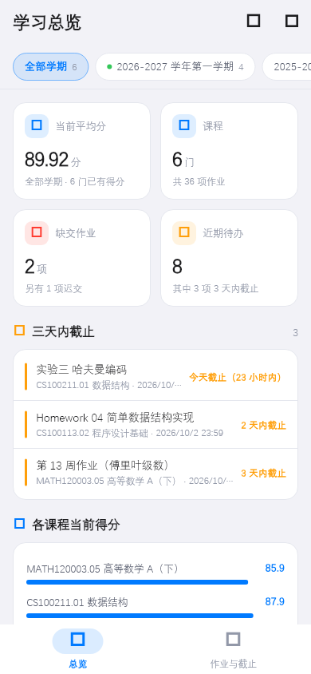
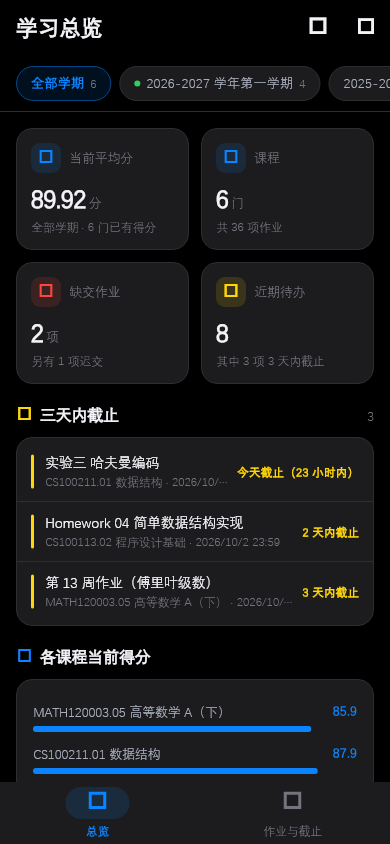
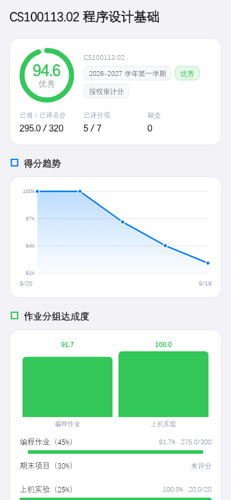

# 复旦大学 eLearning 学习看板 — iOS / Android 客户端

Flutter 实现的移动端，逻辑与桌面端（Electron）完全同源：同一套统一身份认证流程、
同一套 Canvas 接口口径、同一套成绩算法与设计 token。

界面参考复旦校园助手 [DanXi（旦夕）](https://github.com/DanXi-Dev/DanXi) 的设计语言：
iOS 风格的浅灰底 + 纯白卡片，主色 `#007AFF`；深色为纯黑底 + `#1C1C1E` 抬升卡片。

<p align="center">
  
  
  
</p>

---

## 为什么这个项目值得单独存在

桌面端那些最难啃的部分——**从认证服务器自己的前端代码里逆向出登录协议**、
**纯 Dart 实现 PKCS#1 v1.5 加密**、**已交作业不误标逾期的判定**——
在这里被原样继承，并且都有测试锁住。

## 快速开始

### 只看界面（不需要账号）

```bash
cd flutter_app
flutter run --dart-define=DEMO=true
```

演示数据铺了两个学期、六门课，包含「已交未批改且已过截止」这种容易出错的记录。

### 真实使用

```bash
cd flutter_app
flutter run          # 需要连接校园网或 VPN
```

## 技术要点

### 认证：与服务器完全一致

整条链路是从 `id.fudan.edu.cn/ac/js/chunk-*.js` 读出来后逐项实测验证的：

```
GET  elearning.fudan.edu.cn/login/cas
  → 302 id.fudan.edu.cn/idp/authCenter/authenticate
  → SPA #/index?lck=...&entityId=...
POST /idp/authn/getJsPublicKey        → RSA 公钥（SPKI base64）
POST /idp/authn/queryAuthMethods      → authChainCode / moduleCodes / requestType
POST /idp/authn/verifyCodeIsNeed      → 提交前先问要不要验证码
POST /idp/authn/authExecute           → RSA/PKCS#1 v1.5 加密后提交
POST /idp/authCenter/authnEngine      → 换取 CAS 票据
GET  <logon>?ticket=...               → Canvas 会话
```

**提交前先查验证码**是刻意的：学校会因多次失败锁定账号，
所以明知会失败就不该消耗一次尝试。

### 加密：只能用纯 Dart 实现

这里没有任何平台 API 可用：

- **Web Crypto 只有 RSA-OAEP**，没有 PKCS#1 v1.5 加密（已实测，`NotSupportedError`）；
- **iOS 的 Security.framework** 也不直接暴露 PKCS#1 v1.5 加密。

所以用 `pointycastle` 在 Dart 层实现。正确性由交叉验证保证：
`tool/rsa_probe.dart` 用 **Dart 加密**，交给 **Node 的 `node:crypto` 解密**——
后者已实测与学校服务器一致，所以只要它能解开，Dart 版就是对的。

### HTTP：不用 `package:http`

`package:http` 会把同名响应头合并成一个字符串，`Set-Cookie` 因此丢失边界，
而整条登录链依赖逐跳精确收集 Cookie。这里直接用 `dart:io` 的 `HttpClient`，
并用本地 HTTP 服务器实测确认多 `Set-Cookie` 能逐条拿到。

传输层是抽象出来的（`HttpTransport`），因此：

- 协议逻辑（Cookie、重定向）是**纯 Dart**，可以用假传输层完整测试，不联网；
- web 上退化成明确的错误桩；
- `flutter build web` 能编译通过。

## 目录结构

```
lib/
  core/            纯 Dart，不含任何 Flutter 依赖
    endpoints.dart   服务地址
    cookies.dart     Cookie 容器（跨域登录链必需）
    http.dart        Cookie + 重定向逻辑（纯 Dart）
    transport*.dart  各平台传输层（条件导入）
    uis.dart         统一身份认证
    rsa.dart         RSA/PKCS#1 v1.5
    canvas.dart      Canvas REST 客户端（含 Link 头分页）
    scoring.dart     成绩计算、学期归组、缓存升级
    aggregate.dart   拉取并组装快照
    session.dart     存储抽象
    demo.dart        演示数据
  platform/        各平台存储实现（shared_preferences / 钥匙串）
  state/           应用状态
  ui/              界面
  theme.dart       设计 token（与桌面端一致）
test/
  core_test.dart   核心逻辑（Cookie、解析、成绩、缓存兼容）
  ui_test.dart     界面渲染 + 逾期判定回归
  golden_test.dart 渲染成图，人工核对视觉
tool/
  rsa_probe.dart   交叉验证用
```

## 验证

```bash
flutter analyze                          # 静态检查
flutter test --exclude-tags golden       # 54 项：核心逻辑 + 界面渲染
flutter test test/golden_test.dart --update-goldens   # 重新生成截图
```

跨仓库的加密交叉验证（在仓库根目录）：

```bash
node recon/test-dart-rsa-interop.mjs
```

## 各平台怎么出包

Flutter 一套代码，四个目标。**注意 iPad 不是一个独立目标**——iOS 包本身就跑在 iPad 上。

| 平台 | 怎么构建 | 需要 Mac？ | 安装方式 |
| --- | --- | --- | --- |
| **iPhone** | `flutter build ios --no-codesign`（或 CI） | 出包需要，可交给 CI | Sideloadly / AltStore 侧载 |
| **iPad** | 同上，**同一个包** | 同上 | 同上 |
| **macOS** | `flutter build macos --release`（或 CI） | 出包需要，可交给 CI | 解压 .app，右键→打开 |
| **Android** | `flutter build apk --release` | **不需要**，Windows 上就能出 | 直接装 APK |

### iPad 需要做的不是新建目标，而是自适应布局

Xcode 工程里已经是 `TARGETED_DEVICE_FAMILY = "1,2"`（1=iPhone，2=iPad），
所以同一个二进制本来就能跑在 iPad 上。真正要做的是**让界面适配宽屏**，这个已经做了：

- 宽度 ≥ 760 时，底部导航换成左侧 `NavigationRail`
- 内容限宽 1080 并居中，避免窗口拉宽后一行只有几个字

`test/golden_test.dart` 里有 iPad 横屏（1194×834）和 Mac 窗口（1440×900）的渲染测试，
断言宽屏下确实用的是 `NavigationRail` 而不是 `NavigationBar`。

### macOS 的额外注意

macOS 应用没做**公证（notarization）**——那需要付费开发者账号。
未公证的 app 首次打开会被 Gatekeeper 拦下，绕过方式：

```bash
xattr -cr /Applications/fudan_elearning.app
```

或者右键 → 打开（只需一次）。

---

## 在 Windows 上本地构建 Android 包

这一步实测可行，但国内网络 + Windows 会踩四个坑，都记录在这里。

### 0. 需要装的东西

```powershell
# JDK 17（Temurin）
#   官方源在 GitHub Releases，国内基本下不动，用清华镜像：
#   https://mirrors.tuna.tsinghua.edu.cn/Adoptium/17/jdk/x64/windows/OpenJDK17U-jdk_x64_windows_hotspot_17.0.20.1_1.zip

# Android 命令行工具（Google 源国内可直连）
#   https://dl.google.com/android/repository/commandlinetools-win-11076708_latest.zip
#   解压后必须是 <sdk>/cmdline-tools/latest/ 这个层级，sdkmanager 才认

$env:JAVA_HOME = 'D:\jdk-17'
$env:ANDROID_HOME = 'D:\android-sdk'
& "$env:ANDROID_HOME\cmdline-tools\latest\bin\sdkmanager.bat" `
    'platform-tools' 'platforms;android-36' 'build-tools;36.0.0' --sdk_root=$env:ANDROID_HOME

& flutter config --android-sdk $env:ANDROID_HOME
& flutter doctor      # 应当看到 Android toolchain 打勾
```

Flutter 3.47 要求 **compileSdk 36 / targetSdk 36 / minSdk 24**。

### 坑 1：Gradle 发行包下不动

`services.gradle.org` 会重定向到被墙的 CDN，报
`Gradle threw an error while downloading artifacts from the network`。
`android/gradle/wrapper/gradle-wrapper.properties` 里已经指向腾讯云镜像。

### 坑 2：项目路径含非 ASCII 字符 → release 构建必失败

**这是本项目最需要注意的一点。** 仓库路径是 `D:\vit\杂\elearning`，「杂」字会让：

- Android Gradle 插件直接拒绝构建（可加 `android.overridePathCheck=true` 绕过检查）；
- **但 release 构建仍会在 Dart AOT 阶段失败**，因为原生工具 `gen_snapshot`
  拿到的路径被错误解码（「杂」→「锟斤拷」），读不到 `app.dill`：

  ```
  Error: Unable to read file: D:\vit\锟斤拷\elearning\flutter_app\...\app.dill
  ```

**debug 构建（JIT，不做 AOT）不受影响；release / profile 必须在纯 ASCII 路径下构建。**

```powershell
robocopy D:\vit\杂\elearning\flutter_app D:\build\fudan_elearning /E `
  /XD build .dart_tool .gradle .idea .cxx
cd D:\build\fudan_elearning
flutter build apk --release
```

长期方案是把仓库整体挪到纯英文路径（例如 `D:\dev\elearning`）。

### 坑 3：Kotlin 增量编译缓存写盘失败

报 `Could not close incremental caches in .../caches-jvm/...`。
在 `android/gradle.properties` 里加：

```properties
kotlin.incremental=false
```

### 坑 4：release 包默认用调试证书签名

Flutter 模板的 `android/app/build.gradle.kts` 里写着 `signingConfig = signingConfigs.getByName("debug")`。
产出的 APK **能装能跑，但不能上架**——自己用正合适。
想换成正式签名就自己生成 keystore 并改这段配置。

### 产物

```
build/app/outputs/flutter-apk/app-release.apk   ≈ 50 MB（含 arm64 / armv7 / x86_64 三套原生库）
```

直接传到手机上安装，或用 `adb install app-release.apk`。

---

## 成本

**自己用的话，最低 0 元。**

### 构建：0 元

`macos-latest` 运行器对**公开仓库免费**。私有仓库用 Free 计划的 2,000 分钟/月，
但 macOS 按 **10 倍**折算，等于 **200 分钟 macOS/月**——一次 Flutter 构建约 6–12 分钟，
够跑 20 次上下。超出后约 $0.062/分钟。

所以**不需要为了出包买 Mac**。Android 包更简单，Windows 上直接 `flutter build apk`。

### 装机：0 元，或 ¥688/年

苹果不让你随便装自己写的 App，差别就在签名：

| | 免费 Apple ID | 付费开发者账号（$99/年 ≈ ¥688） |
| --- | --- | --- |
| 证书有效期 | **7 天** | 1 年 |
| 可注册设备数 | 最多 3 台 | 每类 100 台 |
| 能上架 App Store | 不能 | 可以 |
| 推送 / iCloud 等能力 | 不支持 | 支持 |

**只想自己用**的话：

- **0 元方案**：用免费 Apple ID 配 Sideloadly 侧载，**每 7 天重签一次**。
  用 AltStore 可以连上同一 Wi-Fi 时自动续签，基本无感。
- **¥688/年方案**：一年签一次，省心。功能上对你没有额外好处（你不上架、不用推送）。

Android 侧载完全免费，Google Play 的 $25 一次性费用你不需要。

**结论：一次性成本 0 元**，除非你嫌每周重签麻烦，那就每年 ¥688。

### 参考

- [GitHub Actions 计费与每分钟费率](https://costops.dev/guides/github-actions-pricing)（macOS 10 倍折算、Free 计划 2,000 分钟）
- [免费 Apple ID 能做什么](https://dev.to/datastack/what-can-a-free-apple-id-do-without-joining-the-paid-developer-program-3e4a)（7 天证书、最多 3 台设备）


## 课程文件

每门课的详情页最下面有「课程文件」一节：展示 Canvas 上的文件夹与文件树，
点文件名直接下载，勾选框可多选批量，也可以「下载本课全部」。

### 下载到哪

```
<下载根目录>/<学期>/<课程名>/<Canvas 子文件夹...>/<文件名>
```

例：`2026-2027 学年第一学期/CS100113.02 程序设计基础/课件/第1章/绪论.pdf`

- **iOS**：应用文档目录。Info.plist 里开了文件共享，「文件」App 里能看到，
  可以整个文件夹拷到 iCloud。
- **Android**：应用专属外部目录（`Android/data/<包名>/files/eLearning`）。
  targetSdk 36 下受分区存储限制不能直接写公共 Download 目录，
  否则要申请 `MANAGE_EXTERNAL_STORAGE` 这种很重的权限，不划算。

### 几个容易踩的点

- **文件名净化**：Canvas 上的文件名可能含 `/ : * ? " < > |` 或结尾是点，
  这些在 Windows 上非法、拷到电脑就会出问题。统一替换为下划线，
  并给 `CON`/`NUL`/`COM1` 这类保留设备名加前缀。
- **重名去重**：同一目录下的重名会变成 `名字 (2).ext`。
  比较时忽略大小写——文件拷到 Windows / macOS 后 `A.pdf` 与 `a.pdf` 会互相覆盖。
- **先写 `.part` 再改名**：下载中断不会留下一个看起来完整、实际残缺的文件。
- **同名同大小直接跳过**：重复点「下载全部」不会重复拉取。
- **排序**：文件夹按 Canvas 的 `position` 排（这样「第一章」才会在「第二章」前面，
  按拼音排会反过来）；文件按自然序排（`第2章` 在 `第10章` 前）。
- **不并发**：一次只跑一个下载任务，避免把校园网和服务端打满。

### 两端的实现是各写一遍的

`lib/core/files.dart` 与桌面端的 `src/core/files.ts` 是两份独立实现，
靠一组**逐条对应的单元测试**保证行为一致
（`test/files_test.dart` ↔ `cli/test-files.ts`）。

这套测试已经抓到过两次真实分歧：

1. 中文排序——桌面端原本用 `localeCompare('zh-Hans-CN')` 走拼音序，
   Dart 的 `compareTo` 是 UTF-16 码位序。统一成码位序，
   真正影响观感的文件夹顺序交给 Canvas 的 `position`。
2. `safeJoin` 遇到绝对路径——桌面端抛错，Dart 端会悄悄变成根目录下的子路径。
   统一成抛错，让问题暴露而不是生成一个谁也没预期的嵌套目录。


- **web 端不能取数据**：浏览器有 CORS 限制且 Web Crypto 做不了 PKCS#1 v1.5。
  web 只用于界面渲染验证。
- **Android 工程已生成但未验证**：本机没有 Android SDK，未经真机测试。
- **二次验证（2FA）暂不支持**：账号若启用了二次验证，会明确提示并建议先用浏览器登录一次。
